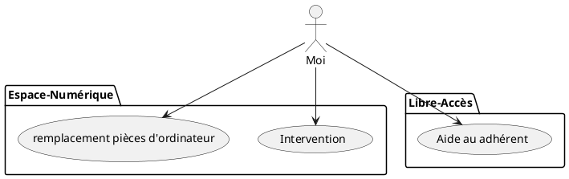

# **Compte rendu de stage**
## *1ère année*

>prénom:
>Anass

>nom:
>Smail

>mes compétences:
>>C#, html, Css, SQL, php, python.

>Entreprise:
>>stage dans une association numérique nommée l'espace 19 à paris composé de 5 salariés et de 2 bénévoles, une association chargée d'intervenir dans les autres espaces 19, lors de problème survenue sur le matériel informatique. Ainsi qu'une aide envers les personnes ne savant pas utiliser un outil informatique, via un seconds espace numérique nommée le libre accès, mettant à disposition des adhérents des ordinateurs pour leur documents administratifs, etc, ainsi que des formations dans l'apréhension de l'utilisation d'ordinateur.

>pour mon stage, des fichiers google sheets m'était partagé, à l'aide de ces fichiers. je pouvais me tenir compte des interventions dans les différents espaces. Ainsi que faire un audit des différents espaces, j'ai aussi réparé des ordinateurs pour cela des composants était mis à notre disposition dans une réserve. et enfin, je venais en aide a des adhérents quand ils avaient un problème sur leur ordinateur ou un besoin d'aide a la manipulation d'un logiciel.

>les compétences acquises:
>>j'ai était au contact de plusieurs adhérents cela ma permis de m'ouvrir un peu plus ainsi que le contact des gens, j'ai aussi eu a travaillé a plusieurs donc à apprendre le travail d'équipe via le départagement des tâches, ainsi que la transmission d'information via les fichiers m'ayant était fourni.

